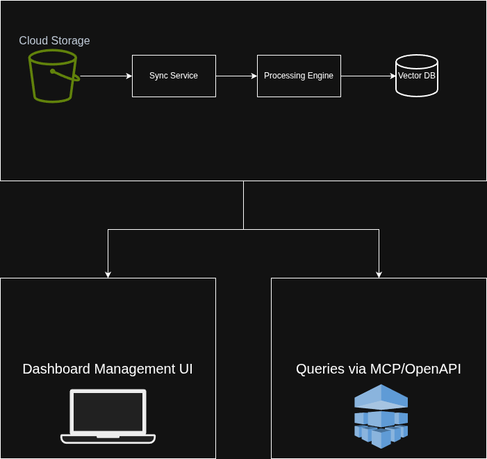

# Design Document - Adaptive RAG Intelligence System
## Open WebUI Group B

---

## 1. Executive Summary

### The Problem
Current RAG systems fail when knowledge bases contain diverse document types (financial reports, legal contracts, technical docs) because they use one-size-fits-all chunking and retrieval strategies.

### Our Solution
**Adaptive RAG system with four key innovations:**

1. **Cloud Sync** - Auto-sync from S3 (extensible plugin architecture for other providers)
   2. Pain point resolved: Manual upload at scale impossible
2. **Adaptive Processing** - Analyzes document structure and selects optimal chunking strategies automatically
   3. Pain point resolved: Static chunking leads to poor retrieval
3. **Dual API Access** - MCP server for LLM integration + OpenAPI for programmatic access
   4. Pain point resolved: Limited access methods
4. **Knowledge Base Dashboard** - Monitor document health, sync status, and analytics
   5. Pain point resolved: Lack of visibility into KB health

### High Level Architecture


---

## 2. Architecture & Component Design

## Container Architecture Overview

The system is composed of loosely coupled service containers responsible for document ingestion, processing, storage, query handling, and system management. These containers communicate through well-defined APIs and shared data stores to enable scalable and modular document intelligence workflows.

---

### 1. Cloud Sync Service (Python / FastAPI)

The Cloud Sync Service acts as the ingestion gateway between external storage providers and the document processing pipeline. It is responsible for detecting document changes and initiating downstream processing workflows.

#### Responsibilities

**S3 Event Processor**
- Polls SQS for storage event notifications
- Detects file creation, updates, and deletions
- Triggers ingestion workflows

**Delta Sync Scheduler**
- Performs periodic reconciliation scans
- Ensures document consistency between storage and internal state
- Recovers missed or failed events

**Plugin Manager**
- Loads provider-specific cloud storage plugins
- Enables extensibility for additional storage providers beyond S3

---

### 2. Document Processing Engine (Python)

The Document Processing Engine transforms raw documents into structured, searchable semantic data. It serves as the core transformation and enrichment layer of the system.

#### Responsibilities

**Document Parser**
- Uses Unstructured.io to extract text and document elements
- Supports multiple file formats (PDF, DOCX, HTML, etc.)

**Structure Analyzer**
- Identifies document layout and hierarchy
- Extracts headings, sections, tables, and metadata

**Chunking Strategy Selector**
- Dynamically determines chunking strategy based on document type and structure
- Optimizes retrieval accuracy and embedding performance

**Embedding Service**
- Generates vector embeddings for document chunks
- Prepares semantic data for vector storage and retrieval

---

### 3. Vector Database (Qdrant)

Qdrant provides semantic search and vector-based retrieval capabilities. It stores embeddings generated by the processing engine along with associated metadata.

#### Responsibilities
- Stores vector embeddings for document chunks
- Maintains metadata indices for filtering and contextual retrieval
- Executes similarity search for query resolution

---

### 4. Query Engine (Python / FastAPI)

The Query Engine serves as the primary interface for client access and retrieval logic. It coordinates semantic search, metadata filtering, and response preparation.

#### Responsibilities

**MCP Server**
- Supports Model Context Protocol via http
- Enables AI tool integration (e.g., Open WebUI, Claude, Cursor, etc)

**REST API**
- Provides OpenAPI-compatible endpoints
- Supports web and mobile client integrations

**Result Ranking and Filtering**
- Combines vector similarity with metadata filters
- Formats structured responses for client consumption

---

### 5. Dashboard Management UI (React + Tailwind CSS)

The Dashboard UI provides administrative and operational visibility into system activity and configuration.

#### Responsibilities
- Document lifecycle management
- System health and processing monitoring
- Configuration management and plugin control

---

### 6. PostgreSQL Database

PostgreSQL serves as the operational data store supporting system state, metadata tracking, and user management.

#### Stored Data Includes
- Document metadata and indexing references
- Processing status and ingestion tracking
- System health metrics and logs
- User and configuration data

---

## Component Interaction Flow

### Document Ingestion Flow

Document ingestion begins when new or updated files are detected in cloud storage. Storage events are propagated through the synchronization service, which triggers the processing pipeline.

#### Ingestion Sequence
1. Storage events are generated by S3 and delivered through SQS.
2. The Cloud Sync Service consumes events and downloads updated documents.
3. The Document Processing Engine parses document content and analyzes structure.
4. The system selects an appropriate chunking strategy based on document characteristics.
5. Document chunks are generated and converted into vector embeddings.
6. Embeddings are stored in Qdrant for semantic retrieval.
7. Document metadata and processing state are stored in PostgreSQL.

---

### Query Processing Flow

The query flow enables external clients to retrieve semantically relevant document content using either MCP or REST API interfaces.

#### Query Sequence
1. A client submits a query through MCP or REST API endpoints.
2. The Query Engine processes and normalizes the request.
3. Qdrant performs vector similarity search to identify relevant document chunks.
4. PostgreSQL provides metadata filtering and contextual constraints.
5. The Query Engine ranks and formats results.
6. The final response is returned to the client.

---

## 3. TECHNICAL STACK & JUSTIFICATIONS

### Backend

| Technology | Purpose | Why Chosen | Alternatives Considered |
|-----------|---------|------------|------------------------|
| **FastAPI** | Backend framework | • Auto OpenAPI generation<br>• Async support for concurrent ops<br>• Type hints (Pydantic)<br>• Fast development | Django (too heavy),<br>Flask (no async) |
| **Python 3.11+** | Language | • Rich ML/AI ecosystem<br>• Great library support | Node.js (weaker AI libs),<br>Go (steeper learning curve) |
| **Unstructured.io** | Document parsing | • Handles 25+ formats<br>• Structure-aware extraction<br>• Open source + API option | Docling (less mature),<br>LlamaParse (API-only, cost) |
| **LlamaIndex** | Chunking framework | • Built for RAG workflows<br>• Multiple chunking strategies<br>• Auto metadata extraction | LangChain (more general,<br>less RAG-focused) |
| **Qdrant** | Vector database | • Open source <br>• Advanced filtering<br>• Rust performance<br>• Self-host friendly | Pinecone (managed only, cost),<br>Weaviate (higher resource use) |
| **PostgreSQL** | Relational DB | • Robust, proven<br>• JSONB for semi-structured data<br>• Team familiarity | MongoDB (less structure),<br>MySQL (weaker JSON support) |
| **Celery + Redis** | Job queue | • Mature, production-proven<br>• Priority queues<br>• Good monitoring | RQ (simpler but limited),<br>asyncio (no persistence) |
| **boto3** | AWS S3 SDK | • Official AWS library<br>• Comprehensive features | aioboto3 (overkill for our use) |

### Frontend

| Technology       | Purpose | Why Chosen | Alternatives Considered |
|------------------|---------|------------|------------------------|
| **React 19**     | UI framework | • Hooks, modern patterns<br>• Largest ecosystem<br>• Team familiarity | Vue (smaller ecosystem),<br>Svelte (less mature) |
| **Tailwind CSS** | Styling | • Utility-first, fast dev<br>• No bloat (unused purged)<br>• Modern aesthetic | Material-UI (opinionated),<br>Bootstrap (dated) |
| **Recharts**     | Data visualization | • React-native<br>• Declarative API<br>• Good for dashboards | Chart.js (imperative),<br>D3 (steep curve) |
| **React Query**  | Server state | • Caching built-in<br>• Auto refetching<br>• Optimistic updates | Redux (overkill for us),<br>SWR (less features) |
| **Vite**         | Build tool | • Fast HMR<br>• Modern defaults<br>• ESM-first | Create React App (slow),<br>Webpack (complex config) |

### APIs & Integration

| Technology | Purpose | Why Chosen |
|-----------|---------|------------|
| **FastMCP** | MCP server impl | • Minimal boilerplate<br>• Pydantic integration<br>• Type-safe |
| **OpenAPI 3.0** | API spec | • Industry standard<br>• Auto-generated docs<br>• Client SDK generation |
| **OpenAI Ada-003** | Embeddings | • High quality<br>• 1536 dimensions<br>• Cost-effective |

### DevOps

| Technology | Purpose | Why Chosen |
|-----------|---------|------------|
| **Docker** | Containerization | • Consistent environments<br>• Easy deployment |
| **Docker Compose** | Local dev | • Multi-container mgmt<br>• Simple setup |

---

## 4. FRONTEND DESIGN & UX

### Design Philosophy
- **Enterprise-focused:** Information density over minimalism
- **Dashboard-centric:** Analytics and monitoring primary use case
- **Progressive disclosure:** Advanced features hidden until needed

### Color Palette

- Primary: Blue (#3B82F6) 
- Secondary: Slate (#64748B) 
- Success: Green (#10B981)
- Warning: Amber (#F59E0B)
- Danger: Red (#EF4444)
- Background: Gray (#252525)

# BELOW THIS HAS NOT BEEN REVIEWED AND ARE JAS's IDEAS FORMATTED INTO ROUGH SECTIONS
### Key Screens & Wireframes

#### 1. Knowledge Base List View

**[DIAGRAM PLACEHOLDER 5: KB List Wireframe]**

Elements to include:
- Left sidebar: Navigation (Home, Knowledge Bases, Settings)
- Top bar: Search, User profile, Notifications
- Main content:
    - Header: "Knowledge Bases" + "Create New" button
    - Table/Card grid showing:
        - KB name
        - Document count
        - Last sync time
        - Health score (visual indicator)
        - Actions (View, Configure, Delete)

#### 2. Document Health Dashboard

**[DIAGRAM PLACEHOLDER 6: Health Dashboard Wireframe]**

Layout:
- **Top metrics row:**
    - Total documents
    - Stale documents (count + %)
    - Avg retrieval frequency
    - Overall health score

- **Heatmap visualization:**
    - Color-coded document retrieval frequency
    - Hover shows document name + stats

- **Document list table:**
    - Name | Type | Last Updated | Retrieval Count | Health Score | Actions
    - Sortable columns
    - Filter by type, health, date

- **Right sidebar:**
    - Quick actions
    - Recent activity log

#### 3. Document Detail View

**[DIAGRAM PLACEHOLDER 7: Document Detail Wireframe]**

Sections:
- **Header:** Document name, type badge, health indicator
- **Metadata panel:**
    - Source (S3 path)
    - Size
    - Created/Updated dates
    - Processing strategy used

- **Tabs:**
    1. **Overview:** Summary stats, preview snippet
    2. **Strategy:** Rationale for chunking choice, detected features
    3. **Chunks:** List of chunks with similarity preview
    4. **Health:** Retrieval history chart, staleness indicator

- **Action buttons:**
    - Reprocess
    - Override strategy
    - View in S3
    - Delete

#### 4. Sync Configuration Page

**[DIAGRAM PLACEHOLDER 8: Sync Config Wireframe]**

Form layout:
- Provider selection (S3 initially, future: GCS, Azure)
- S3-specific fields:
    - Bucket name
    - Prefix (optional)
    - Region
    - Authentication (IAM role / Access keys)
- Sync settings:
    - Sync frequency (real-time + daily reconciliation)
    - File filters (extensions, patterns)
- Test connection button
- Save configuration

### User Flows

**[DIAGRAM PLACEHOLDER 9: User Flow - Setup New KB]**
```
1. Click "Create Knowledge Base"
2. Enter name, description
3. Configure S3 sync (bucket, auth)
4. Test connection
5. Choose processing defaults (can override later)
6. Save → Redirects to KB dashboard
7. Background: Initial sync starts
```

**[DIAGRAM PLACEHOLDER 10: User Flow - Query via Claude]**
```
1. User opens Claude Desktop
2. Claude has MCP server configured (one-time setup)
3. User asks question
4. Claude calls search_knowledge_base tool (transparent to user)
5. Results returned, cited in response
```

### Component Library

**Reusable components to build:**
- `<Card>` - Container for metrics/content
- `<DataTable>` - Sortable, filterable table
- `<Heatmap>` - Color-coded visualization
- `<HealthBadge>` - Visual health indicator (green/yellow/red)
- `<MetricCard>` - Single metric display (number + trend)
- `<LineChart>` - Time-series visualization
- `<FilterPanel>` - Sidebar filter controls
- `<DocumentCard>` - Document preview card

---

## 5. BACKEND DESIGN

### Cloud Sync Service Architecture

**[DIAGRAM PLACEHOLDER 11: Sync Service Components]**

```
CloudSyncService
├── PluginManager (discovers and loads plugins)
├── S3Plugin (implements CloudStoragePlugin interface)
│   ├── EventProcessor (SQS polling)
│   ├── DeltaSyncScheduler (daily full scan)
│   └── S3Client (boto3 wrapper)
├── FileTrackingDB (PostgreSQL tracking)
└── DocumentQueue (Celery tasks)
```

### Plugin Architecture

**Abstract Base Class (ABC) Pattern:**

```python
class CloudStoragePlugin(ABC):
    """All cloud providers must implement this interface"""
    
    @abstractmethod
    def list_files(bucket: str, prefix: str) -> List[FileMetadata]:
        """Returns list of files with metadata (key, etag, modified date)"""
        pass
    
    @abstractmethod
    def download_file(bucket: str, key: str, local_path: str):
        """Downloads file to local path"""
        pass
    
    @abstractmethod
    def setup_event_notifications(bucket: str, config: dict) -> bool:
        """Configure bucket events → SNS → SQS"""
        pass
    
    @abstractmethod
    def test_connection() -> bool:
        """Verify credentials work"""
        pass
```

**Plugin Discovery:**
- Plugins live in `/plugins/cloud_storage/*.py`
- At startup, PluginManager scans directory
- Any class inheriting `CloudStoragePlugin` is auto-registered
- No manual registration needed - just drop file in directory

**Why This Design:**
- **Extensible:** Adding GCS/Azure = drop new plugin file, no core changes
- **Type-safe:** ABC enforces interface at import time
- **Simple:** No complex plugin framework, just inheritance
- **Clean:** Core system doesn't know about specific providers

### Document Processing Pipeline

**[DIAGRAM PLACEHOLDER 12: Processing Pipeline Flow]**

```
1. File Downloaded from S3
   ↓
2. Document Parser (Unstructured.io)
   - Extracts text, tables, images
   - Detects structure (headers, lists, code)
   ↓
3. Structure Analyzer
   - Counts tables, headers, sections
   - Measures text density
   - Identifies metadata (dates, entities)
   ↓
4. Strategy Selector
   - Input: Document features
   - Output: Best chunking strategy
   - Strategies: Semantic, Hierarchical, Layout-aware, Table-preserving
   ↓
5. Chunking Engine (LlamaIndex)
   - Applies selected strategy
   - Preserves structure boundaries
   - Adds metadata to chunks
   ↓
6. Embedding Service
   - Generates vectors (OpenAI Ada-003)
   - Batch processing for efficiency
   ↓
7. Storage
   - Vectors → Qdrant
   - Metadata → PostgreSQL
   - Original file → S3 (already there)
```

### Chunking Strategies

Based on research, we implement 4 strategies:

| Strategy | When to Use | Implementation |
|----------|-------------|----------------|
| **Semantic** | General text, articles, docs | LlamaIndex SentenceSplitter<br>Splits by semantic meaning<br>Chunk size: 512 tokens |
| **Hierarchical** | Long docs with clear structure | LlamaIndex HierarchicalNodeParser<br>Builds parent-child relationships<br>Top-level: sections, Bottom: paragraphs |
| **Layout-aware** | PDFs with complex layouts | Respects page/column boundaries<br>Preserves visual structure |
| **Table-preserving** | Documents with many tables | Unstructured table detection<br>Keeps tables as single chunks<br>Never splits mid-table |

**Strategy Selection Heuristics (MVP):**
```python
def select_strategy(doc_features):
    """Simple rule-based selector for MVP"""
    if doc_features.table_count > 5:
        return "table-preserving"
    elif doc_features.section_depth > 3:
        return "hierarchical"
    elif doc_features.is_pdf and doc_features.has_multicolumn:
        return "layout-aware"
    else:
        return "semantic"  # default
```

*(Post-MVP: Replace with ML model trained on retrieval performance)*

### Query Engine Architecture

**[DIAGRAM PLACEHOLDER 13: Query Engine Components]**

```
QueryEngine
├── VectorSearch (Qdrant client)
│   └── Similarity search with metadata filters
├── MetadataFilter (PostgreSQL)
│   └── Pre-filter by type, date, health
├── HybridSearch (future)
│   └── Combines vector + keyword (BM25)
├── ResultRanker
│   └── Re-ranks by recency, health score
└── ResponseFormatter
    ├── MCP format
    └── OpenAPI format
```

**Search Flow:**
1. Query arrives (MCP or REST API)
2. Generate query embedding (same model as docs)
3. Filter by metadata if provided (e.g., `document_type: financial`)
4. Vector similarity search in Qdrant (top-k results)
5. Re-rank by health score + recency
6. Format response with citations
7. Return to client

---

## 6. API DESIGN (MCP + OpenAPI)

### MCP Server Design

**Transport:** stdio (simpler for MVP)

**Tools Exposed:**

1. **search_knowledge_base**
    - Input: `{query: string, top_k?: int, filters?: object}`
    - Output: `{results: [...], query: string, total_results: int}`
    - Use: Primary search interface

2. **get_document**
    - Input: `{document_id: string}`
    - Output: `{document_id, title, content, metadata}`
    - Use: Retrieve full document by ID

3. **list_documents**
    - Input: `{limit?: int, offset?: int, filters?: object}`
    - Output: `{documents: [...], total_count: int}`
    - Use: Browse available documents

4. **get_document_metadata**
    - Input: `{document_id: string}`
    - Output: `{metadata, health_score, retrieval_count, ...}`
    - Use: Get document stats without full content

**Implementation:**
```python
from fastmcp import FastMCP

mcp = FastMCP(name="Adaptive RAG Server")

@mcp.tool()
async def search_knowledge_base(
    query: str,
    top_k: int = 5,
    filters: dict = {}
) -> dict:
    """Search knowledge base with semantic similarity"""
    results = await query_engine.search(query, top_k, filters)
    return {
        "results": results,
        "query": query,
        "total_results": len(results)
    }
```

### OpenAPI Design

**Base URL:** `/api/v1`

**Core Endpoints:**

```
# Knowledge Base Management
GET    /knowledge-bases
POST   /knowledge-bases
GET    /knowledge-bases/{kb_id}
DELETE /knowledge-bases/{kb_id}

# Document Operations
GET    /knowledge-bases/{kb_id}/documents
GET    /knowledge-bases/{kb_id}/documents/{doc_id}
DELETE /knowledge-bases/{kb_id}/documents/{doc_id}

# Search & Query
POST   /knowledge-bases/{kb_id}/search

# Health & Analytics
GET    /knowledge-bases/{kb_id}/health
GET    /knowledge-bases/{kb_id}/analytics

# Sync Management
GET    /knowledge-bases/{kb_id}/sync/status
POST   /knowledge-bases/{kb_id}/sync/trigger

# API Key Management
GET    /api-keys
POST   /api-keys
DELETE /api-keys/{key_id}
```

**Authentication:** API Key in header `X-API-Key: <key>`

**Example Search Request:**
```bash
POST /api/v1/knowledge-bases/kb_123/search
X-API-Key: sk_abcdef...

{
  "query": "What is our Q3 revenue?",
  "top_k": 5,
  "filters": {
    "document_type": "financial",
    "date_after": "2025-07-01"
  },
  "min_similarity": 0.7
}
```

**Example Response:**
```json
{
  "results": [
    {
      "document_id": "doc_456",
      "document_title": "Q3 2025 Financial Report",
      "chunk_text": "Q3 revenue reached $12.5M...",
      "similarity_score": 0.92,
      "metadata": {
        "source": "s3://bucket/financials/q3-2025.pdf",
        "document_type": "financial",
        "last_updated": "2025-10-15T10:30:00Z"
      }
    }
  ],
  "query": "What is our Q3 revenue?",
  "total_results": 1,
  "execution_time_ms": 45
}
```

---

## 7. DATABASE ARCHITECTURE

### PostgreSQL Schema

**[DIAGRAM PLACEHOLDER 14: Database Schema ERD]**

**Main Tables:**

```sql
-- Knowledge Bases
CREATE TABLE knowledge_bases (
    id UUID PRIMARY KEY,
    name VARCHAR(255) NOT NULL,
    description TEXT,
    created_at TIMESTAMP DEFAULT CURRENT_TIMESTAMP,
    updated_at TIMESTAMP DEFAULT CURRENT_TIMESTAMP
);

-- Sync Configurations
CREATE TABLE sync_configs (
    id UUID PRIMARY KEY,
    kb_id UUID REFERENCES knowledge_bases(id),
    provider VARCHAR(50) NOT NULL, -- 's3', 'gcs', 'azure'
    bucket_name VARCHAR(255) NOT NULL,
    prefix VARCHAR(500),
    region VARCHAR(50),
    auth_method VARCHAR(50), -- 'iam_role', 'access_key'
    credentials JSONB, -- encrypted
    last_sync TIMESTAMP,
    sync_status VARCHAR(50), -- 'active', 'paused', 'error'
    created_at TIMESTAMP DEFAULT CURRENT_TIMESTAMP
);

-- Documents
CREATE TABLE documents (
    id UUID PRIMARY KEY,
    kb_id UUID REFERENCES knowledge_bases(id),
    source_path VARCHAR(1000) NOT NULL, -- S3 key
    title VARCHAR(500),
    document_type VARCHAR(100), -- 'financial', 'legal', 'technical'
    file_size_bytes BIGINT,
    content_hash VARCHAR(64), -- SHA-256
    created_at TIMESTAMP,
    updated_at TIMESTAMP,
    last_synced TIMESTAMP,
    processing_status VARCHAR(50), -- 'pending', 'processing', 'completed', 'failed'
    chunk_count INT,
    chunking_strategy VARCHAR(100)
);

-- File Tracking (for delta sync)
CREATE TABLE s3_file_tracking (
    s3_key VARCHAR(1024) PRIMARY KEY,
    kb_id UUID REFERENCES knowledge_bases(id),
    etag VARCHAR(64) NOT NULL,
    last_modified TIMESTAMP NOT NULL,
    size_bytes BIGINT NOT NULL,
    last_synced TIMESTAMP DEFAULT CURRENT_TIMESTAMP,
    processing_status VARCHAR(50),
    document_id UUID REFERENCES documents(id)
);

-- Document Health Metrics
CREATE TABLE document_health (
    document_id UUID PRIMARY KEY REFERENCES documents(id),
    retrieval_count INT DEFAULT 0,
    last_retrieved TIMESTAMP,
    positive_feedback INT DEFAULT 0,
    negative_feedback INT DEFAULT 0,
    staleness_days INT,
    health_score DECIMAL(3,2), -- 0.00 to 1.00
    updated_at TIMESTAMP DEFAULT CURRENT_TIMESTAMP
);

-- Chunks (metadata only, vectors in Qdrant)
CREATE TABLE chunks (
    id UUID PRIMARY KEY,
    document_id UUID REFERENCES documents(id),
    chunk_index INT NOT NULL,
    content TEXT,
    token_count INT,
    metadata JSONB,
    qdrant_point_id UUID, -- reference to Qdrant
    created_at TIMESTAMP DEFAULT CURRENT_TIMESTAMP
);

-- Query Logs
CREATE TABLE query_logs (
    id UUID PRIMARY KEY,
    kb_id UUID REFERENCES knowledge_bases(id),
    query TEXT NOT NULL,
    filters JSONB,
    top_k INT,
    results_count INT,
    execution_time_ms INT,
    user_id VARCHAR(255),
    api_key_id UUID,
    created_at TIMESTAMP DEFAULT CURRENT_TIMESTAMP
);

-- API Keys
CREATE TABLE api_keys (
    id UUID PRIMARY KEY,
    key_hash VARCHAR(64) NOT NULL UNIQUE,
    name VARCHAR(255),
    user_id VARCHAR(255),
    created_at TIMESTAMP DEFAULT CURRENT_TIMESTAMP,
    expires_at TIMESTAMP,
    last_used TIMESTAMP,
    is_active BOOLEAN DEFAULT TRUE
);

-- Processing Jobs (Celery task tracking)
CREATE TABLE processing_jobs (
    id UUID PRIMARY KEY,
    job_type VARCHAR(50), -- 'document_process', 'sync', 'reindex'
    document_id UUID REFERENCES documents(id),
    status VARCHAR(50), -- 'queued', 'running', 'completed', 'failed'
    started_at TIMESTAMP,
    completed_at TIMESTAMP,
    error_message TEXT,
    created_at TIMESTAMP DEFAULT CURRENT_TIMESTAMP
);
```

**Indexes:**
```sql
CREATE INDEX idx_documents_kb_id ON documents(kb_id);
CREATE INDEX idx_documents_status ON documents(processing_status);
CREATE INDEX idx_chunks_document ON chunks(document_id);
CREATE INDEX idx_s3_tracking_kb ON s3_file_tracking(kb_id);
CREATE INDEX idx_query_logs_kb ON query_logs(kb_id);
CREATE INDEX idx_query_logs_created ON query_logs(created_at);
```

### Qdrant Schema

**Collection Structure:**
```python
{
    "collection_name": "adaptive_rag_kb_{kb_id}",
    "vectors": {
        "size": 1536,  # OpenAI Ada-003 dimension
        "distance": "Cosine"
    },
    "payload_schema": {
        "chunk_id": "uuid",
        "document_id": "uuid",
        "document_title": "text",
        "chunk_text": "text",
        "chunk_index": "integer",
        "document_type": "keyword",
        "created_at": "datetime",
        "metadata": "object"
    }
}
```

**Why Separate Collections per KB:**
- Tenant isolation
- Easy KB deletion (drop collection)
- Independent scaling

**Payload Indexing:**
```python
# Create indexes for fast filtering
qdrant_client.create_payload_index(
    collection_name=f"adaptive_rag_kb_{kb_id}",
    field_name="document_type",
    field_schema="keyword"
)
```

---

## 8. KEY DESIGN DECISIONS & TRADE-OFFS

### Decision 1: Event-Driven S3 Sync (Primary) + Daily Reconciliation (Backup)

**What we chose:** Hybrid approach
- Real-time: S3 → SNS → SQS → Backend
- Safety net: Daily full bucket scan

**Alternatives considered:**
- Pure polling: Simple but high latency, inefficient
- Pure events: Fast but risky (missed events in rare cases)

**Why hybrid wins:**
- Events: Real-time sync (enterprise requirement)
- Daily scan: Catches any missed files (reliability)
- Best of both: Fast + reliable

**Trade-offs:**
- ✅ Reliability guaranteed
- ✅ Real-time updates
- ❌ Slightly more complex setup
- ❌ Minimal extra cost (SNS/SQS pennies per million)

**Decision:** Worth the complexity for enterprise reliability

---

### Decision 2: Qdrant over Pinecone/Weaviate

**What we chose:** Qdrant

**Alternatives:**
- **Pinecone:** Managed-only, usage-based pricing, excellent but expensive at scale
- **Weaviate:** Feature-rich, GraphQL API, higher resource usage
- **Qdrant:** Open-source + managed option, Rust performance, advanced filtering

**Comparison:**

| Aspect | Qdrant | Pinecone | Weaviate |
|--------|--------|----------|----------|
| Deployment | Self-host or cloud | Cloud only | Self-host or cloud |
| Filtering | Best-in-class | Good | Good |
| Performance | Excellent (Rust) | Excellent | Good (resource-heavy) |
| Cost (self-host) | $0 (compute only) | N/A | $0 (compute only) |
| Cost (managed) | Moderate | High | Moderate |
| Ease of use | Good | Excellent | Moderate |

**Why Qdrant:**
- ✅ Self-hosting option = cost control as we scale
- ✅ Advanced filtering critical for metadata-heavy RAG
- ✅ Rust performance handles enterprise scale
- ✅ Good Python client
- ✅ Team can move to managed later if needed

**Trade-offs:**
- ❌ Not as beginner-friendly as Pinecone
- ❌ Smaller ecosystem than Weaviate
- ✅ But: Better performance/$ ratio for our needs

---

### Decision 3: LlamaIndex over LangChain for Chunking

**What we chose:** LlamaIndex

**Why:**
- Built specifically for RAG (retrieval-first)
- Auto metadata extraction + storage
- Cleaner chunking abstractions
- Better document-to-vector pipeline

**LangChain strengths (why we didn't choose):**
- Better for multi-step agent workflows
- More general-purpose tooling
- Larger ecosystem

**Our use case:** Primarily document → chunks → embeddings → retrieval
**Winner:** LlamaIndex (35% better retrieval accuracy per benchmarks)

**Trade-offs:**
- ✅ Better RAG performance
- ✅ Less boilerplate
- ❌ Smaller community than LangChain
- ❌ Less flexibility for non-RAG tasks

**Mitigation:** Use LangChain for any future agent features

---

### Decision 4: React + Tailwind over Material-UI

**What we chose:** React + Tailwind CSS

**Alternatives:**
- Material-UI (MUI): Complete design system, opinionated
- Ant Design: Enterprise-focused, opinionated
- Bootstrap: Dated aesthetic

**Why Tailwind:**
- ✅ Utility-first = faster custom designs
- ✅ No bloat (unused classes purged)
- ✅ Modern aesthetic
- ✅ Easier to create unique look (enterprise branding)
- ✅ Better for dashboard/data-heavy UIs

**Why NOT MUI:**
- ❌ Harder to customize deeply
- ❌ "Google look" limits brand differentiation
- ❌ Heavier bundle size

**Trade-offs:**
- ✅ Full design control
- ✅ Smaller bundle
- ❌ More manual component building
- ❌ No out-of-box theme system

**Mitigation:** Use Headless UI + Tailwind for pre-built accessible components

---

### Decision 5: FastAPI over Django

**What we chose:** FastAPI

**Why:**
- ✅ Auto OpenAPI spec generation (saves time)
- ✅ Async/await native (critical for concurrent S3 downloads, embeddings)
- ✅ Pydantic validation (type safety)
- ✅ Faster development for APIs
- ✅ Modern Python (type hints everywhere)

**Why NOT Django:**
- ❌ Heavier (ORM, admin, templates not needed)
- ❌ Sync-first (async support bolted on)
- ❌ Overkill for API-only backend

**Trade-offs:**
- ✅ Faster API development
- ✅ Better async performance
- ❌ Less "batteries included" than Django
- ❌ Must pick auth, admin panel separately

**Mitigation:** Add django-admin later if needed for internal tools

---

### Decision 6: Plugin ABC Pattern (Not Full Plugin Framework)

**What we chose:** Simple Abstract Base Class pattern

**NOT:** Heavy plugin frameworks (Pluggy, Stevedore)

**Why simple:**
- ✅ Just drop `.py` file in `/plugins/` → auto-discovered
- ✅ ABC enforces interface at import time (fail fast)
- ✅ No complex config files
- ✅ Easy to understand (team can contribute)
- ✅ Good enough for 3-5 cloud providers

**Why NOT heavy framework:**
- ❌ Overkill for our use case
- ❌ Steeper learning curve
- ❌ More abstraction layers
- ❌ Harder to debug

**Trade-offs:**
- ✅ Simplicity
- ✅ Easy contribution
- ❌ Less plugin lifecycle management
- ❌ No plugin versioning (don't need it)

**This is pragmatic engineering:** Right tool for the job, not over-engineering.

---

### Decision 7: MCP stdio (Not HTTP) for MVP

**What we chose:** stdio transport for MCP

**Why:**
- ✅ Simpler setup (no HTTP server config)
- ✅ Works perfectly for local clients (Claude Desktop, Cursor)
- ✅ Lower latency (no network overhead)
- ✅ Secure (no network exposure)
- ✅ Matches 90% of enterprise use case (dev tools)

**Why NOT HTTP:**
- Not needed for MVP
- Adds complexity
- Requires auth/rate limiting
- Network latency

**Future migration path:**
- Post-MVP: Add HTTP transport if remote access needed
- Same tool implementations work for both transports
- Easy upgrade

**Trade-offs:**
- ✅ Faster to ship
- ✅ Simpler to maintain
- ❌ Single client at a time (acceptable for dev tools)
- ❌ Can't share across team (future: add HTTP)

---

### Decision 8: Heuristic Strategy Selection (MVP), ML Later

**What we chose:** Rule-based strategy selection for MVP

**Why:**
```python
if doc.table_count > 5:
    strategy = "table-preserving"
elif doc.section_depth > 3:
    strategy = "hierarchical"
else:
    strategy = "semantic"
```

**Why NOT ML from day 1:**
- Need performance data first (chicken-egg problem)
- ML requires labeled training data (which strategies work)
- Heuristics work well enough to start collecting data
- Faster to ship

**Migration path:**
1. MVP: Heuristic rules + log all decisions
2. Week 4-5: Collect retrieval performance data
3. Post-MVP: Train ML model on actual performance
4. Replace heuristics with learned model

**Trade-offs:**
- ✅ Ship faster
- ✅ Get real data from production
- ✅ Rules are interpretable
- ❌ Not optimal initially (but good enough)
- ✅ Foundation for ML later

**This is lean methodology:** Ship, learn, improve.

---

### Decision 9: Unstructured.io over Docling/LlamaParse

**What we chose:** Unstructured.io

**Why:**
- ✅ Most mature (25+ document formats)
- ✅ Open source + paid API option (flexibility)
- ✅ Good table extraction
- ✅ Structure-aware (preserves headers, sections)
- ✅ Active development

**Alternatives:**
- **Docling (IBM):** Excellent accuracy but newer, less format support
- **LlamaParse:** Fast but API-only (lock-in), struggles with complex layouts

**Benchmark data:**
- Unstructured: 100% accuracy on simple tables, 80% on complex
- Docling: 95% accuracy overall but slower
- LlamaParse: 85% accuracy, 6s processing (fastest)

**Why Unstructured wins:**
- Balance of accuracy, speed, format support
- Open source = no vendor lock-in
- Can upgrade to API if needed
- Good community

**Trade-offs:**
- ✅ Best balance
- ✅ No lock-in
- ❌ Slower than LlamaParse (acceptable: 50s for 50 pages)
- ❌ Not quite as accurate as Docling (acceptable: 80% is good)

---

### Decision 10: Celery + Redis over Simpler Queues

**What we chose:** Celery with Redis backend

**Alternatives:**
- RQ (Redis Queue): Simpler, less features
- asyncio + Database: Lightweight, no separate service
- AWS SQS: Managed but couples to AWS

**Why Celery:**
- ✅ Battle-tested in production
- ✅ Priority queues (process events before scans)
- ✅ Retries, monitoring, result storage
- ✅ Can add workers for scaling
- ✅ Team familiarity

**Why Redis:**
- ✅ Fast
- ✅ Also useful for caching query results
- ✅ Single service does double duty

**Trade-offs:**
- ✅ Production-ready
- ✅ Scalable
- ❌ More complex than RQ
- ❌ Another service to manage
- ✅ Worth it for enterprise reliability

---

AI Use Disclosure: This is an AI-based project. Generative AI tools are used as part of the solution development, along with human review, testing, and documentation of design decisions.