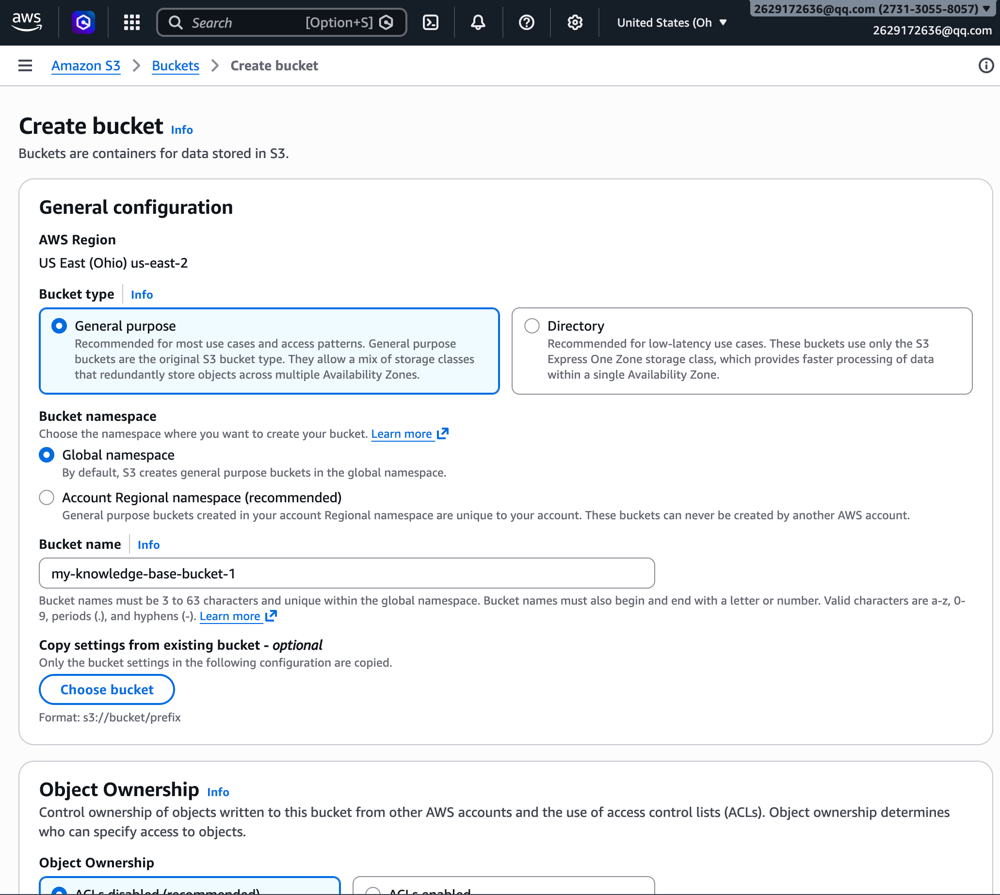
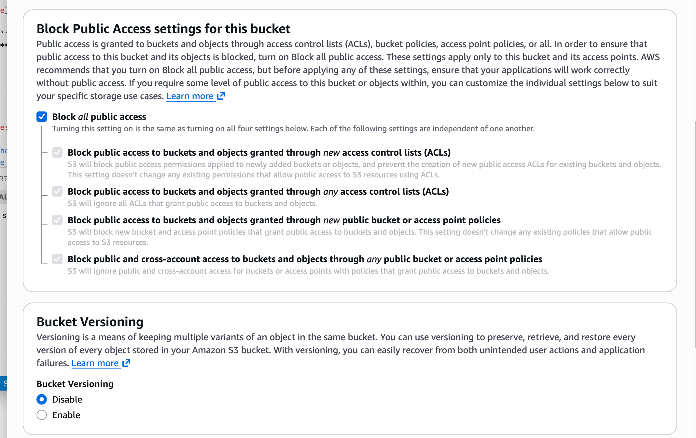
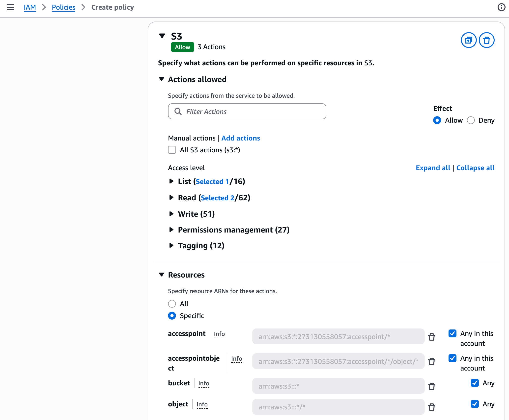
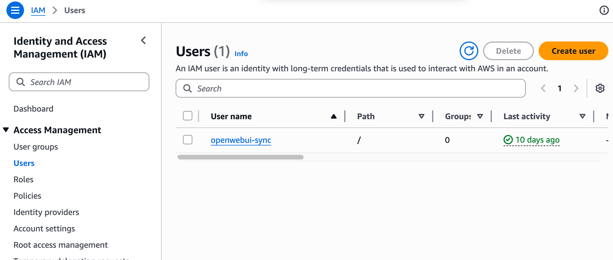
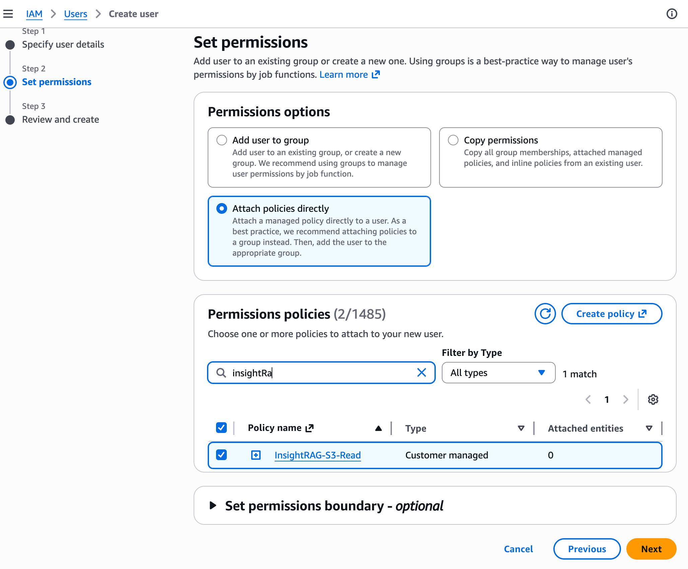
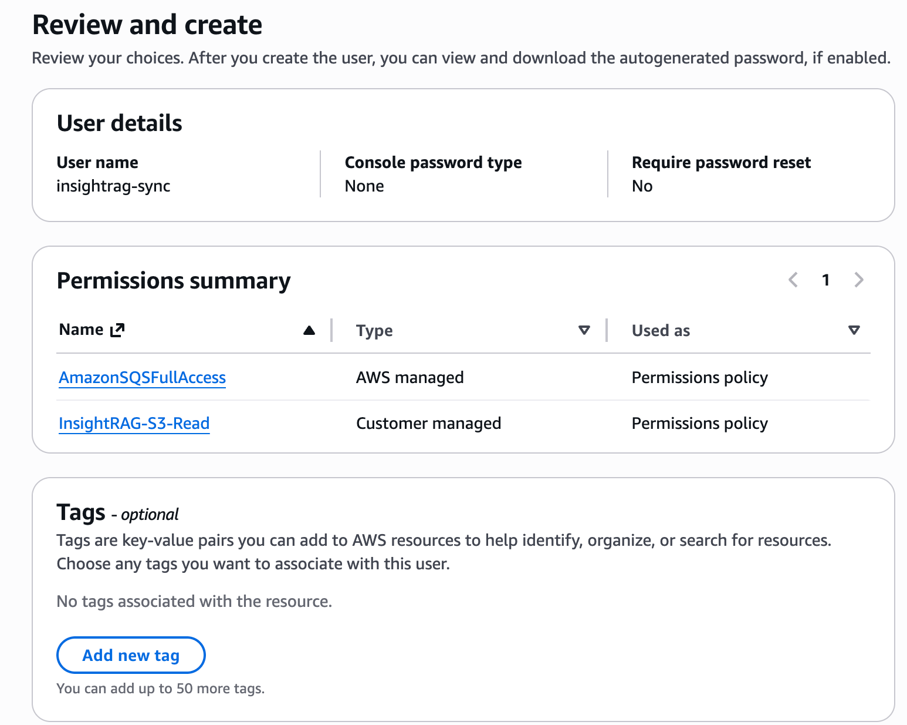
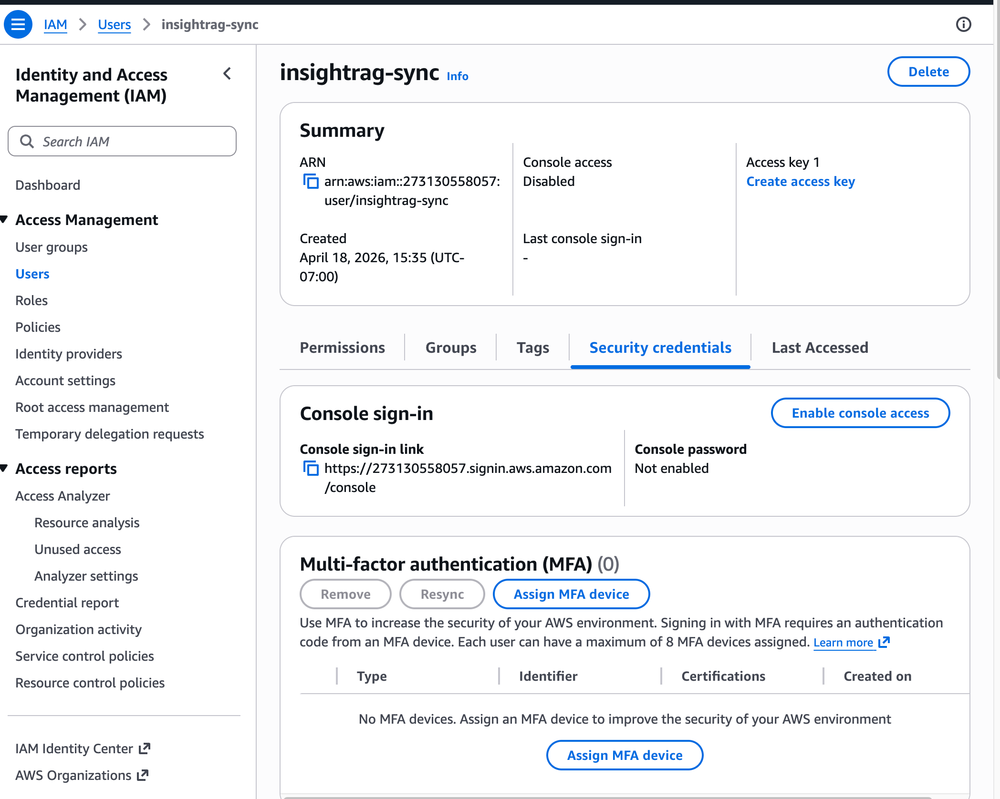
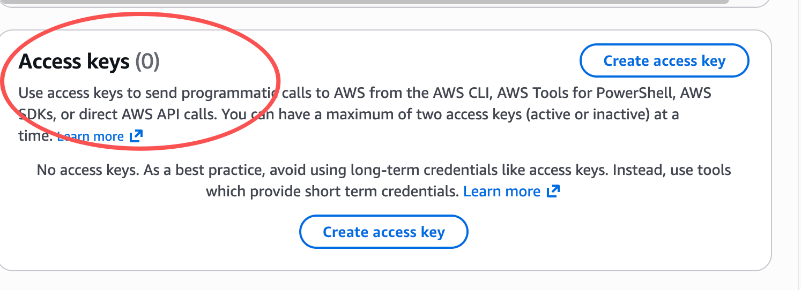
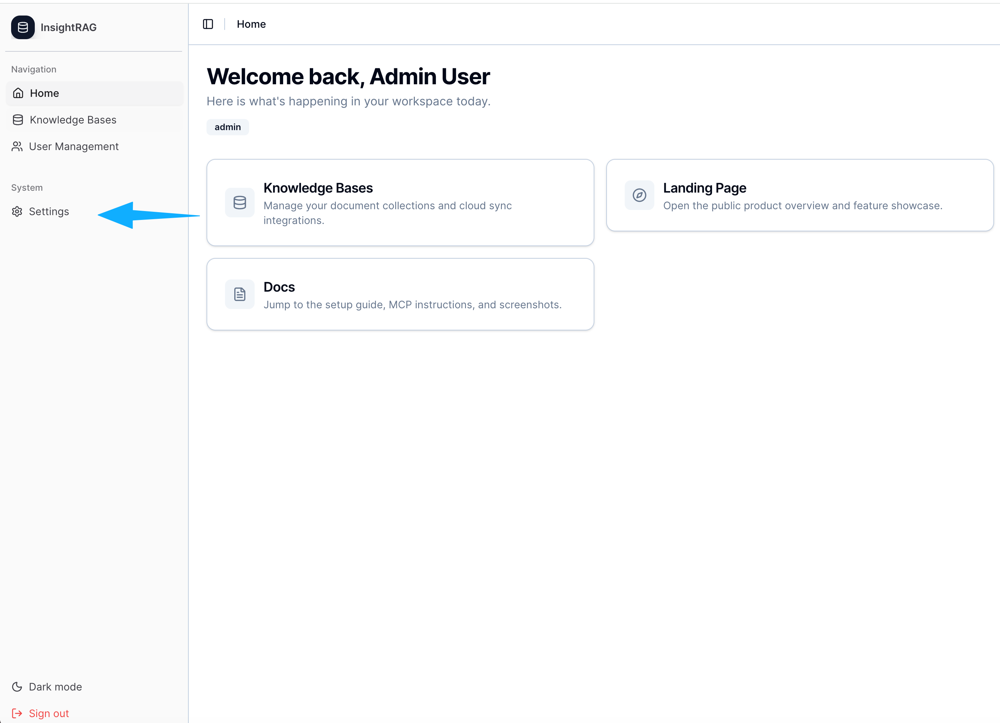
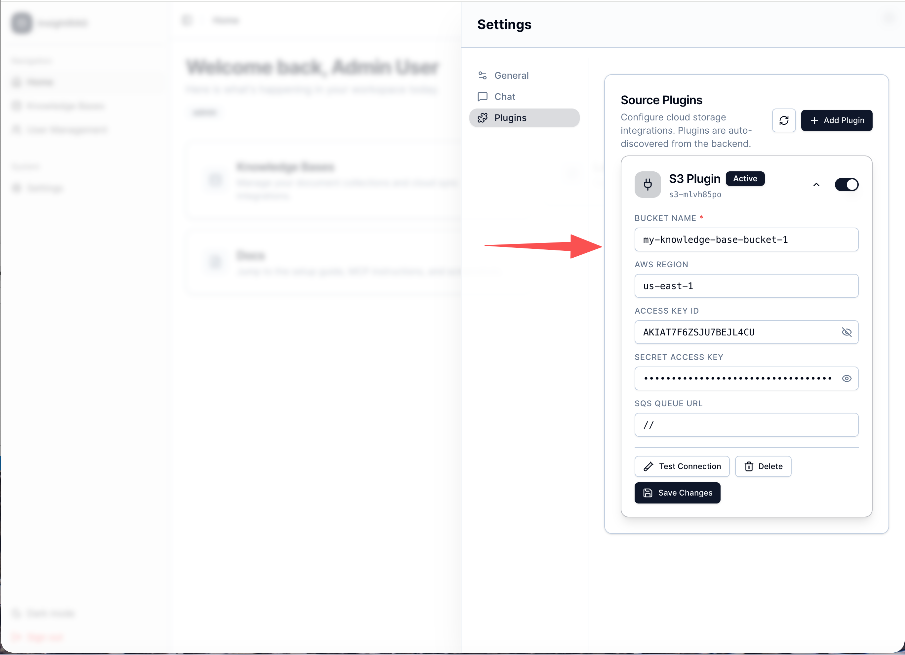

# InsightRAG — Project Handover Document

**Course:** CPSC 319  
**Team:** Sherry Rui Xia, Jaskirat Gill, and team  
**Handover Date:** April 20, 2025  
**Project:** InsightRAG — Knowledge Base Control Plane for RAG Systems

---

## Quick Status Overview

| Status | Features |
|--------|---------|
| **Fully working** | Authentication & RBAC, Knowledge Base management, Document sync from S3, Document processing pipeline (parse → chunk → embed → index), Hybrid search (vector + keyword), MCP server with 3 tools, Retrieval analytics & heatmaps, Health dashboard, User management, CI/CD pipeline |
| **Partially working** | Document strategy override (saves setting but does not re-trigger processing), Real-time S3 sync via SQS (works if SQS is configured; falls back to polling otherwise) |
| **Not implemented** | Chat interface (UI component exists but not accessible), Additional sync plugins (only S3 is supported), Rate limiting, Observability / metrics (Prometheus, Jaeger) |

---

## Demo Access

Use these credentials to log in to any running instance — no setup required.

| Field | Value |
|-------|-------|
| **Email** | `admin@example.com` |
| **Password** | `Admin123!` |

- **Live instance:** https://cpsc319.jaskiratgill.ca
- **Local (after setup):** http://localhost:5173

The database is automatically seeded with this admin account on first start. You do not need to create a user manually.

---

## Table of Contents

1. [Project Overview](#1-project-overview)
2. [Technology Stack](#2-technology-stack)
3. [Prerequisites](#3-prerequisites)
4. [Step-by-Step Setup Guide](#4-step-by-step-setup-guide)
   - [Step 1: Clone the Repository](#step-1-clone-the-repository)
   - [Step 2: Configure Environment Variables](#step-2-configure-environment-variables)
   - [Step 3: Set Up AWS S3 Credentials](#step-3-set-up-aws-s3-credentials)
   - [Step 4: Start Backend Services](#step-4-start-backend-services)
   - [Step 5: Start the Frontend](#step-5-start-the-frontend)
   - [Step 6: Access the Application](#step-6-access-the-application)
   - [Step 7: First-Time Login](#step-7-first-time-login)
   - [Step 8: Configure the S3 Plugin](#step-8-configure-the-s3-plugin)
   - [Step 9: Create a Knowledge Base](#step-9-create-a-knowledge-base)
   - [Step 10: Sync Documents](#step-10-sync-documents)
   - [Step 11: Get Your Access Token (for MCP)](#step-11-get-your-access-token-for-mcp)
   - [Step 12: Connect an MCP Client](#step-12-connect-an-mcp-client)
5. [How to Use the System](#5-how-to-use-the-system)
6. [Feature Summary](#6-feature-summary)
   - [Implemented Features](#61-implemented-features)
   - [Features Not Implemented](#62-features-not-implemented)
   - [Partially Implemented Features](#63-partially-implemented-features)
7. [Known Bugs and Limitations](#7-known-bugs-and-limitations)
8. [Codebase Structure](#8-codebase-structure)
9. [Production Deployment](#9-production-deployment)
10. [Future Work & How to Continue](#10-future-work--how-to-continue)
11. [Troubleshooting](#11-troubleshooting)

---

## 1. Project Overview

**InsightRAG** is a knowledge base control plane for Retrieval-Augmented Generation (RAG) systems. It allows teams to:

- **Sync** documents from external cloud storage (AWS S3) into a managed index via a plugin system
- **Process** documents through a pipeline: parse → chunk → generate embeddings → index into a Qdrant vector database
- **Search** indexed content using hybrid retrieval (vector + keyword search with RRF fusion)
- **Expose** search capabilities via a Model Context Protocol (MCP) server, compatible with Claude and other AI assistants
- **Monitor** knowledge base and document health, retrieval analytics, and chunk-level statistics through a web UI
- **Manage** users, roles, and API keys with a role-based access control (RBAC) system

**Live deployment:** `https://cpsc319.jaskiratgill.ca` (DigitalOcean droplet, requires access)

**Built-in documentation:** Visit `/docs` on any running instance (e.g., `http://localhost:5173/docs` locally or `https://cpsc319.jaskiratgill.ca/docs`) for the interactive docs site covering Quick Start, Features, Plugin Setup, MCP Setup, and team information.

**GitHub repository:** https://github.com/jaskirat-gill/InsightRAG

---

## 2. Technology Stack

| Layer | Technology |
|-------|-----------|
| Frontend | React 19, Vite 7, TypeScript, Tailwind CSS, Radix UI |
| Sync Service (API) | Python 3.11, FastAPI 0.109, SQLModel, Celery |
| Document Processing | Python 3.11, Celery, sentence-transformers, unstructured |
| Query Engine | Python 3.11, FastAPI 0.109 |
| MCP Server | Python 3.11, FastMCP 3.0 |
| Vector Database | Qdrant |
| Relational Database | PostgreSQL 15 |
| Cache / Task Queue | Redis 7 |
| Containerization | Docker, Docker Compose |
| Reverse Proxy | nginx (production) |
| CI/CD | GitHub Actions → DigitalOcean droplet |
| Node.js | v22 (frontend build) |

---

## 3. Prerequisites

Before setting up the project locally, ensure the following are installed:

| Tool | Minimum Version | Download |
|------|----------------|---------|
| Docker Desktop | 24+ | https://www.docker.com/products/docker-desktop |
| Docker Compose | v2 (bundled with Docker Desktop) | (included) |
| Node.js | 22+ | https://nodejs.org |
| npm | 10+ (bundled with Node.js) | (included) |
| Git | Any recent version | https://git-scm.com |

**Optional** (for MCP integration):
- An AWS account with an S3 bucket (see Step 3)
- Claude Desktop or another MCP-compatible client

**Verify your installations** by running:

```bash
docker --version
docker compose version
node --version
npm --version
git --version
```

---

## 4. Step-by-Step Setup Guide

### Step 1: Clone the Repository

Open your terminal and run:

```bash
git clone https://github.com/jaskirat-gill/InsightRAG.git
cd InsightRAG
```

<!-- Screenshot: terminal showing successful git clone output -->

---

### Step 2: Configure Environment Variables

The project uses a `.env` file to store configuration. A template is provided.

```bash
cp .env.example .env
```

Open `.env` in a text editor and fill in the required values:

```env
# ── AWS / S3 (required for document sync) ────────────────
AWS_ACCESS_KEY_ID=AKIA...          # Your AWS Access Key ID
AWS_SECRET_ACCESS_KEY=wJalr...     # Your AWS Secret Access Key
AWS_REGION=us-east-1               # Your S3 bucket region
S3_BUCKET_NAME=your-bucket-name    # Your S3 bucket name

# ── SQS (required — must be a valid queue URL, see Step 3e) ──
SQS_QUEUE_URL=https://sqs.us-east-1.amazonaws.com/123456789012/insightrag-s3-events

# ── Sync Scheduler ───────────────────────────────────────
# How often background sync runs (seconds). Set to 0 to disable.
SYNC_INTERVAL_SECONDS=300

# ── Frontend API Base ────────────────────────────────────
# For local development, leave as-is:
VITE_API_URL=http://localhost:8000

# ── OpenWebUI Integration (optional) ────────────────────
VITE_OPENWEBUI_BASE_URL=http://localhost:3000
VITE_OPENWEBUI_TOKEN=eyJhbGci...
VITE_OPENWEBUI_TIMEOUT_MS=120000
```

> **Important:** Never commit your `.env` file to version control. It is already listed in `.gitignore`.

<!-- Screenshot: .env file open in a text editor with placeholder values -->

---

### Step 3: Set Up AWS S3 Credentials

If you want to use the document sync feature, you need an AWS S3 bucket and IAM credentials.

#### 3a. Create an S3 Bucket

1. Go to the [Amazon S3 Console](https://s3.console.aws.amazon.com/s3/)
2. Click **Create bucket**
3. Enter a bucket name (e.g., `insightrag-docs`) and select a region
4. Leave **Block Public Access** enabled
5. Click **Create bucket**




#### 3b. Create an IAM Policy

1. Go to [IAM Console → Policies](https://us-east-1.console.aws.amazon.com/iamv2/home#/policies)
2. Click **Create policy** → choose **JSON**
   - or use IAM console ui, choose S3 -> List Bucket, GetObject, GetBucketLocations
3. Paste the following (replace `YOUR_BUCKET_NAME`):

```json
{
    "Version": "2012-10-17",
    "Statement": [
        {
            "Effect": "Allow",
            "Action": [
                "s3:ListBucket",
                "s3:GetObject",
                "s3:GetBucketLocation"
            ],
            "Resource": [
                "arn:aws:s3:::YOUR_BUCKET_NAME",
                "arn:aws:s3:::YOUR_BUCKET_NAME/*"
            ]
        }
    ]
}
```

4. Name the policy (e.g., `InsightRAG-S3-Read`) and click **Create policy**


#### 3c. Create an IAM User

1. Go to [IAM Console → Users](https://us-east-1.console.aws.amazon.com/iamv2/home#/users)
2. Click **Create user** → enter a name (e.g., `insightrag-sync`)
3. Select **Attach policies directly** → find and select `InsightRAG-S3-Read` & `AmazonSQSFullAccess` 
4. Click **Create user**





#### 3d. Generate Access Keys

1. Click on the new user → go to **Security credentials** tab
2. Scroll to **Access keys** → click **Create access key**
3. Select **Application running outside AWS**
4. Copy the **Access Key ID** and **Secret Access Key** into your `.env` file




#### 3e. Create an SQS Queue and Wire It to S3 (Required)

`SQS_QUEUE_URL` **must** be a valid SQS queue URL. Leaving it empty or using a placeholder causes the sync to crash with an `InvalidAddress` error.

1. Go to the [Amazon SQS Console](https://console.aws.amazon.com/sqs/)
2. Click **Create queue** → choose **Standard** (not FIFO)
3. Name it (e.g., `insightrag-s3-events`)
4. Set **Receive message wait time** to **5 seconds** (enables long polling)
5. Click **Create queue**
6. Copy the **Queue URL** — it looks like `https://sqs.us-east-1.amazonaws.com/123456789012/insightrag-s3-events`

**Allow S3 to send messages to this queue** — on the SQS queue page, go to **Access policy** and add this statement (replace the three placeholders):

```json
{
    "Effect": "Allow",
    "Principal": { "Service": "s3.amazonaws.com" },
    "Action": "SQS:SendMessage",
    "Resource": "arn:aws:sqs:*:YOUR_AWS_ACCOUNT_ID:YOUR_QUEUE_NAME",
    "Condition": {
        "ArnLike": { "aws:SourceArn": "arn:aws:s3:::YOUR_BUCKET_NAME" }
    }
}
```

**Configure S3 event notifications** — in your S3 bucket:

1. Go to **Properties → Event notifications → Create event notification**
2. Under **Event types** select `s3:ObjectCreated:*` and `s3:ObjectRemoved:*`
3. Under **Destination** choose **SQS queue** and select the queue you just created
4. Click **Save changes**

**Add SQS permissions to the IAM policy** you created in step 3b:

```json
{
    "Effect": "Allow",
    "Action": [
        "sqs:ReceiveMessage",
        "sqs:DeleteMessage",
        "sqs:GetQueueAttributes"
    ],
    "Resource": "arn:aws:sqs:*:YOUR_AWS_ACCOUNT_ID:YOUR_QUEUE_NAME"
}
```

**Add the Queue URL to `.env`:**

```env
SQS_QUEUE_URL=https://sqs.us-east-1.amazonaws.com/123456789012/insightrag-s3-events
```

---

### Step 4: Start Backend Services

From the project root directory, run:

```bash
docker compose up --build
```

This command builds and starts the following 8 services:

| Service | Description | Host Port |
|---------|-------------|-----------|
| `sync-service` | Core API: auth, KB management, plugins, sync | `8000` |
| `query-engine` | Search/query API used by the UI | `8001` |
| `mcp-server` | MCP server for AI assistant integration | `8002` |
| `document-processing-engine` | Celery worker: parse, chunk, embed, index | (none) |
| `postgres` | Relational database (auth, KB metadata) | `5433` |
| `qdrant` | Vector database | `6333` |
| `redis` | Cache and task queue | `6379` |
| `frontend` | Pre-built React UI served by nginx | (no host port by default) |

The first build may take **5–10 minutes** to download images and install dependencies.

<!-- Screenshot: Docker Desktop showing all 8 containers running -->

Wait until you see log output indicating all services are ready. You can verify with:

```bash
# Check sync service health
curl http://localhost:8000/health

# Check query engine health
curl http://localhost:8001/health
```

Both should return `{"status": "ok"}` or similar.

---

### Step 5: Start the Frontend

The recommended approach for local development is to run the Vite dev server outside Docker for fast hot-reloading.

Open a **new terminal window** and run:

```bash
cd frontend
npm ci
npm run dev -- --host
```

<!-- Screenshot: terminal showing Vite dev server starting with "Local: http://localhost:5173" -->

The Vite development server automatically proxies API requests:

- `/api/*` → `http://localhost:8000` (sync service)
- `/plugins/*` → `http://localhost:8000`
- `/sync` → `http://localhost:8000`

> **Alternative (Docker-only frontend):** If you prefer not to run Node.js locally, add the following to the `frontend` service in `docker-compose.yml` and then visit `http://localhost:5173`:
> ```yaml
> ports:
>   - "5173:80"
> ```

---

### Step 6: Access the Application

Open your browser and navigate to:

```
http://localhost:5173
```

You should see the InsightRAG landing page.

<!-- Screenshot: InsightRAG landing page with hero section and navigation -->

The following service dashboards are also available directly:

| Service | URL |
|---------|-----|
| Sync Service API Docs | http://localhost:8000/docs |
| Query Engine API Docs | http://localhost:8001/docs |
| MCP Server | http://localhost:8002/mcp |
| Qdrant Dashboard | http://localhost:6333/dashboard |

---

### Step 7: First-Time Login

The database is automatically seeded with a default admin account. No manual user creation is needed.

1. Go to `http://localhost:5173`
2. Log in with the default admin credentials:

| Field | Value |
|-------|-------|
| **Email** | `admin@example.com` |
| **Password** | `Admin123!` |

<!-- Screenshot: InsightRAG login page with admin credentials entered -->

3. You will be redirected to the Knowledge Bases dashboard

<!-- Screenshot: Knowledge Bases dashboard after login -->

> **Tip:** Once logged in, you can create additional users and assign roles (admin, developer, end_user) from the **User Management** page in the left sidebar.

---

### Step 8: Configure the S3 Plugin

Before syncing documents, you must configure a source plugin that tells the system where to fetch files from.

1. In the left sidebar, click **Settings**
2. Select the **Plugins** tab



3. Click **Add Plugin** (or the `+` button)
4. Fill in the plugin configuration:
   - **Name:** A descriptive name (e.g., `My S3 Source`)
   - **Module:** `app.plugins.s3`
   - **Class:** `S3Plugin`
   - **Active:** Toggle on
   - **Config → bucket_name:** Your S3 bucket name
   - **Config → region_name:** Your AWS region (e.g., `us-east-1`)
   - **Config → sqs_queue_url:** *(optional) but can not be empty* Your SQS queue URL for real-time sync



5. Click **Save**
6. Click **Test Connection** to verify the plugin can reach your S3 bucket

<!-- Screenshot: Plugin list showing the S3 plugin with a green "Connected" status -->


---

### Step 9: Create a Knowledge Base

A Knowledge Base (KB) defines a logical collection of documents with its own processing configuration and routing rules.

1. In the left sidebar, click **Knowledge Bases**
2. Click **New** (top right)

<!-- Screenshot: Knowledge Bases page with the New button highlighted -->

3. Fill in the form:
   - **Name:** A descriptive name (e.g., `Company Policies`)
   - **Description:** *(optional)*
   - **Storage Configuration → Plugin:** Select the S3 plugin you created
   - **Sync Folders:** *(optional)* Enter S3 path prefixes to route into this KB (e.g., `team-a/policies`). Leave empty to sync all files from the plugin.
   - **Chunk Size:** `512` (default — number of tokens per chunk)
   - **Chunk Overlap:** `50` (default — overlap between adjacent chunks)

<!-- Screenshot: New Knowledge Base form filled in -->

4. Click **Create Knowledge Base**

<!-- Screenshot: Knowledge Bases list showing the newly created KB -->

**Routing logic:** When the sync runs, files are routed to a KB based on path prefix matching. The longest matching prefix wins. A KB with no sync folders acts as a catch-all for its plugin.

---

### Step 10: Sync Documents

Once a plugin and KB are configured, trigger a sync to pull documents from S3.

1. On the **Knowledge Bases** page, click **Sync** in the top action bar

<!-- Screenshot: Knowledge Bases page with the Sync button highlighted -->

2. The button changes to **Syncing...** while the request is in flight
3. After the sync API call completes, a status badge appears

<!-- Screenshot: Sync status badge showing "Sync triggered" -->

The sync process works as follows:

1. The sync service queries all active plugins for file listings
2. It compares against previously synced files (delta detection)
3. New or changed files are downloaded to a shared volume
4. Download tasks are queued in Redis for the document processing engine
5. The processing engine parses, chunks, embeds, and indexes each file into Qdrant

> **Background sync:** By default, a background sync runs every 300 seconds (configurable via `SYNC_INTERVAL_SECONDS` in `.env`). Set to `0` to disable automatic background sync.

> **Reset sync cache:** Click **Reset** to clear the sync delta cache. The next sync will re-process all files from scratch. Use with caution.

To check document processing status, click on a KB, then click on any document to view its status badge (`processing`, `completed`, or `failed`).

<!-- Screenshot: Document details page showing status badges -->

---

### Step 11: Get Your Access Token (for MCP)

The MCP server requires a valid bearer token from the sync service auth system.

1. In the left sidebar, click **Settings**
2. Stay on the **General** tab
3. Find the **Session Tokens** section
4. Click **Copy** next to **Access Token**

<!-- Screenshot: Settings General tab showing the Access Token field with Copy button -->

Keep this token safe. It grants access to all knowledge bases associated with your account.

---

### Step 12: Connect an MCP Client

InsightRAG exposes three MCP tools that AI assistants (Claude, etc.) can call:

| Tool | Description |
|------|-------------|
| `search_knowledge_base` | Hybrid search (vector + keyword) across indexed documents |
| `get_available_collections` | List all knowledge bases accessible to the authenticated user |
| `list_kb_resources` | Full inventory of KBs and their documents with metadata |

#### Option A: HTTP Transport (recommended)

The MCP server listens at `http://localhost:8002/mcp`.

Configure your MCP client with:

- **URL:** `http://localhost:8002/mcp`
- **Authentication:** Bearer token (paste the token from Step 11)

**Claude Desktop example** (`claude_desktop_config.json`):

```json
{
  "mcpServers": {
    "insightrag": {
      "command": "curl",
      "args": [
        "-s", "-N",
        "-H", "Authorization: Bearer YOUR_ACCESS_TOKEN",
        "http://localhost:8002/mcp"
      ]
    }
  }
}
```

<!-- Screenshot: Claude Desktop MCP configuration dialog -->

#### Option B: stdio Transport (local development)

```bash
./scripts/run_mcp_stdio.sh
```

The stdio wrapper keeps stdout clean for the MCP protocol.

#### Option C: OpenWebUI Integration

If you are using OpenWebUI:

1. Go to **Settings → Admin Settings → External Tools**
2. Click **+** → change type to **MCP** (not OpenAPI)
3. Set URL to `http://host.docker.internal:8002/mcp`
4. Set bearer auth with the token from Step 11
5. Enter an ID and name → click **Check Connection** → **Save**

<!-- Screenshot: OpenWebUI External Tools settings page with MCP configuration -->

> **Note:** If OpenWebUI only supports a single static bearer token, all OpenWebUI users will share that token's KB access scope.

---

## 5. How to Use the System

Once the system is running and you are logged in, the typical user workflow is:

### Step-by-step workflow

```
Login → Configure Plugin → Create Knowledge Base → Sync Documents → Search / Query via MCP
```

#### 1. Login

Go to `http://localhost:5173` (or the live URL) and sign in with the admin credentials from the [Demo Access](#demo-access) section above.

#### 2. Configure a Source Plugin

Before syncing any documents, the system needs to know where to pull files from.

1. **Settings → Plugins → Add Plugin**
2. Choose **S3Plugin**, enter your AWS S3 bucket name and region
3. Click **Test Connection** to verify it works
4. Save

#### 3. Create a Knowledge Base

A Knowledge Base (KB) is a named collection of documents with its own search index.

1. **Knowledge Bases → New**
2. Give it a name and select the plugin you configured
3. Optionally add **Sync Folders** (S3 path prefixes) to scope which files go into this KB
4. Click **Create Knowledge Base**

#### 4. Sync Documents

Pull documents from S3 and process them into the search index.

1. On the **Knowledge Bases** page, click **Sync**
2. Wait for documents to process — click a document to check its status (`processing` → `completed`)
3. Once completed, the documents are chunked, embedded, and indexed in Qdrant

#### 5. Browse & Monitor

- Click any Knowledge Base to see its documents
- Click a document to open the inline viewer, chunk browser, and retrieval analytics
- Visit the **Health Dashboard** (left sidebar) for KB-level metrics

#### 6. Query via MCP (AI Assistant Integration)

1. **Settings → General → Session Tokens → Copy Access Token**
2. In your MCP client (e.g., Claude Desktop), configure:
   - **URL:** `http://localhost:8002/mcp` (or `https://cpsc319.jaskiratgill.ca/api/mcp/mcp` on the live instance)
   - **Authorization:** `Bearer <your_token>`
3. Use the `search_knowledge_base` tool to ask questions about your indexed documents

#### 7. Manage Users (Admin only)

1. **User Management** (left sidebar) → list all users
2. Assign roles: `admin`, `developer`, or `end_user`
3. Each role has different levels of access to KBs and admin features

---

## 6. Feature Summary

### 6.1 Implemented Features

#### Frontend (React + Vite)

| Feature | Description |
|---------|-------------|
| Authentication | JWT login, token refresh, session expiry dialog, role-based UI |
| Landing page | Animated hero section, feature cards, demo gallery, stats section |
| Documentation pages | Quick start, plugin setup guide, MCP integration guide, team section |
| Knowledge Base dashboard | List all KBs, sync status badges, create/edit KBs |
| Document management | List documents per KB, delete, reassign, view inline |
| Inline document viewer | Renders PDFs, images, and text files directly in the browser |
| Document chunk browser | Browse individual chunks, view retrieval scores |
| Retrieval analytics | Per-document retrieval history with trend charts |
| Document heatmap | Per-page retrieval frequency heatmap for PDFs |
| Health dashboard | KB-level completion rates, chunk counts, retrieval statistics |
| User management | Admin panel to list users and assign roles |
| Settings page | Plugin configuration, access token display, general preferences |
| Dark/light theme | Toggle with persistence in localStorage |
| Responsive design | Mobile-friendly layouts with Framer Motion animations |

#### Supported Document Formats (27+)

| Category | Formats |
|----------|---------|
| Documents | PDF (`.pdf`), Word (`.docx`, `.doc`), OpenDocument (`.odt`), Rich Text (`.rtf`), EPUB (`.epub`) |
| Spreadsheets | Excel (`.xlsx`, `.xls`), CSV (`.csv`), TSV (`.tsv`) |
| Presentations | PowerPoint (`.pptx`, `.ppt`) |
| Text & Markup | Plain text (`.txt`), Markdown (`.md`), HTML (`.html`), JSON (`.json`), XML (`.xml`), YAML (`.yaml`) |
| Images (OCR) | PNG (`.png`), JPEG (`.jpg`), Bitmap (`.bmp`), TIFF (`.tiff`), HEIC (`.heic`) |

#### Processing Strategies

| Strategy | Description |
|----------|-------------|
| Semantic | Splits by sentence boundaries — best for narrative text |
| Auto | General-purpose PDF parsing, good default for most documents |
| Table Heavy | Preserves table structure in dense tabular PDFs |
| Multi-column | Handles newsletters, journals, and multi-column layouts |
| DataViz Heavy | Extracts charts and images from visual-heavy PDFs |
| Section Aware | Splits at headings, never mid-section |
| Table Preserving | Keeps each table intact — best for spreadsheets and CSVs |
| Slide Per Chunk | One chunk per slide — best for presentations |

#### Backend Services

| Feature | Description |
|---------|-------------|
| Auth system | User registration, JWT login (HS256), refresh tokens, bcrypt password hashing |
| RBAC | Roles: admin, developer, end_user; permission tables |
| Knowledge Base CRUD | Create, read, update, delete KBs with routing config |
| S3 plugin | List-objects sync with delta detection via `synced_file` table |
| Background scheduler | Configurable interval sync (default 300s) |
| Document processing pipeline | Parse → chunk → embed (sentence-transformers) → index (Qdrant) |
| Hybrid search | Vector + keyword retrieval with RRF (Reciprocal Rank Fusion) fusion |
| MCP server (HTTP) | Three tools, JWT-authenticated, per-user KB scoping |
| MCP server (stdio) | Local dev transport for stdio-based MCP clients |
| Retrieval tracking | All MCP searches logged to `document_retrieval_history` |
| API key management | Scoped API keys per user |
| Admin API | User listing, role assignment |
| CI/CD pipeline | GitHub Actions: lint, build, pytest, smoke test, deploy to DigitalOcean |

---

### 6.2 Features Not Implemented

| Feature | Notes |
|---------|-------|
| Chat interface | `Chat.tsx` component exists but is not wired into app routing and is not accessible from the UI |
| Additional sync plugins | Only AWS S3 is supported; no Google Cloud Storage, Azure Blob, local filesystem, or HTTP sources |
| Rate limiting | No rate limiting on any API endpoint |
| Observability / metrics | No Prometheus, Jaeger, or structured logging integration |
| Automatic re-processing after strategy override | Strategy override saves to the database but does not trigger the processing pipeline (marked as TODO in code) |
| Offline mode / graceful degradation | UI requires backend connectivity at all times |

---

### 6.3 Partially Implemented Features

| Feature | Status | Notes |
|---------|--------|-------|
| Document strategy override | Partial | UI and API save the strategy to the database, but re-processing is not triggered. The `TODO` comment is at `backend/sync-service/routes/documents.py:435`. |
| Chat page | Partial | `frontend/src/pages/Chat.tsx` contains OpenWebUI integration with model selection and markdown rendering, but no route exists in `App.tsx`. |
| Real-time sync via SQS | Partial | SQS integration is implemented in the S3 plugin and falls back gracefully to list-objects polling when SQS is not configured. Works end-to-end if SQS is set up. |

---

## 7. Known Bugs and Limitations

**Severity scale:**
- **High:** Blocks core functionality or causes major failure
- **Medium:** Significantly affects usability or reliability, but the system still works
- **Low:** Minor issue, cosmetic issue, or edge case

---

#### Bug 1 — Document strategy override does not re-trigger processing `Medium`

**What happens:** When a user changes a document's chunking strategy in the UI (e.g., switching from "Auto" to "Table Heavy"), the new strategy is saved to the database but the document is not re-processed. The chunks in the search index still reflect the original strategy.

**Impact on demo:** The override control appears to work (no error shown), but search results will not reflect the new strategy until a future manual re-sync. This can confuse users who expect immediate re-indexing.

**Workaround:** Click **Reset** on the Knowledge Bases page and then **Sync** again to force full re-processing.

---

#### Bug 2 — Chat page is unreachable `Medium`

**What happens:** The `Chat.tsx` component exists in the codebase with OpenWebUI integration, model selection, and markdown rendering — but no route is defined for it in `App.tsx`. There is no way to navigate to the chat interface from the UI.

**Impact on demo:** The chat feature does not exist from the user's perspective. It is invisible in the running application.

**Workaround:** None. This feature was not completed in time for handover.

---

#### Bug 3 — Session expiry dialog broken state `Medium`

**What happens:** When a login session expires, the app shows a re-login dialog. If the user closes this dialog without logging in again, the app continues running but all API calls silently fail (401 errors). The UI shows no feedback.

**Impact on demo:** If a demo session expires mid-presentation, the app will appear broken. Refreshing the page and logging in again resolves it.

**Workaround:** Refresh the page if the app stops responding after an idle period.

---

#### Bug 4 — No rate limiting on sync/search endpoints `Medium`

**What happens:** Clicking **Sync** repeatedly in quick succession sends multiple sync requests to the backend. Each request creates a separate set of processing jobs in Redis, potentially causing duplicate document processing.

**Impact on demo:** Does not affect normal use. Only an issue if the sync button is clicked many times rapidly.

**Workaround:** Wait for the "Syncing..." state to clear before clicking Sync again.

---

#### Bug 5 — Sync Reset is a global operation `Low`

**What happens:** Clicking **Reset** clears the sync delta cache for all knowledge bases and all plugins at once. If a sync is running concurrently, it may lead to files being re-queued unexpectedly.

**Impact on demo:** Low risk in single-user demo scenarios. Only relevant in a multi-user concurrent environment.

---

#### Bug 6 — Generic S3 error messages `Low`

**What happens:** When a document's S3 presigned URL cannot be generated (e.g., due to expired credentials or missing permissions), the UI shows "Failed to generate S3 URL" with no detail about the root cause.

**Impact on demo:** The inline document viewer may fail to load PDFs or images. The document list still shows correctly.

**Workaround:** Verify AWS credentials in `.env` and confirm the IAM user has `s3:GetObject` permission.

---

#### Bug 7 — No frontend tests `Low`

**What happens:** There are no unit or integration tests for any React component. Correctness relies entirely on manual testing.

**Impact on demo:** Does not affect the running application. A risk for future development — regressions may not be caught.

---

#### Bug 8 — Minimal backend test coverage `Low`

**What happens:** Only the sync-service has tests (3 test cases: plugin manager, password hashing, JWT). The query engine, MCP server, and document processing engine have no tests.

**Impact on demo:** Does not affect the running application. A risk for future development.

---

#### Bug 9 — KB health score misleading during processing `Low`

**What happens:** The health score for a Knowledge Base is calculated only from documents with `completed` status. While documents are still processing, the score may appear lower than the final expected value.

**Impact on demo:** After a sync, wait a few minutes for processing to finish before presenting health metrics.

---

#### Bug 10 — No file size limits on ingestion `Low`

**What happens:** There is no file size check before a document is queued for processing. Very large files (e.g., a 500 MB PDF) may cause the document-processing-engine to time out silently.

**Impact on demo:** Not an issue with normal-sized documents (under ~50 MB). Avoid uploading unusually large files during demos.

---

## 8. Codebase Structure

```
OpenWebUI-Project/
├── frontend/                          # React + Vite + TypeScript UI
│   ├── src/
│   │   ├── pages/                     # Page-level components
│   │   │   ├── KnowledgeBases.tsx     # KB list + sync controls
│   │   │   ├── DocumentDetails.tsx    # Document viewer + analytics
│   │   │   ├── HealthDashboard.tsx    # KB health metrics
│   │   │   ├── Settings.tsx           # Plugin config + tokens
│   │   │   ├── UserManagement.tsx     # Admin user panel
│   │   │   ├── Docs.tsx               # Documentation pages
│   │   │   ├── Landing.tsx            # Landing page
│   │   │   └── Chat.tsx               # (partial) Chat interface
│   │   ├── components/                # Reusable UI components
│   │   ├── App.tsx                    # Root component + routing
│   │   └── main.tsx                   # Entry point
│   ├── package.json                   # Dependencies + scripts
│   └── vite.config.ts                 # Vite config + API proxy
│
├── backend/
│   ├── sync-service/                  # FastAPI: auth, KB CRUD, plugins, sync
│   │   ├── app/
│   │   │   ├── plugins/               # Plugin implementations
│   │   │   │   ├── interface.py       # SourcePlugin base class
│   │   │   │   └── s3.py              # AWS S3 plugin
│   │   │   └── sync_service.py        # Sync orchestration logic
│   │   ├── routes/                    # API route handlers
│   │   │   ├── auth.py                # Login, logout, refresh
│   │   │   ├── knowledge_bases.py     # KB CRUD
│   │   │   ├── documents.py           # Document management
│   │   │   ├── plugins.py             # Plugin management
│   │   │   └── users.py               # User/admin management
│   │   ├── main.py                    # FastAPI app + sync scheduler
│   │   └── AWS_SETUP.md               # AWS S3/SQS setup guide
│   │
│   ├── document-processing-engine/    # Celery worker: parse/chunk/embed/index
│   ├── query-engine/                  # FastAPI: search API for the UI
│   ├── mcp-server/                    # FastMCP: MCP tools + JWT auth
│   ├── database/                      # PostgreSQL schema + seeds
│   │   ├── init.sql                   # Full schema (auto-runs on postgres start)
│   │   ├── seed_documents.sql         # Demo document data
│   │   └── reset_all.sql              # Full database reset
│   └── shared/                        # Shared Python utilities
│
├── deploy/
│   └── nginx/cpsc319.conf             # Production nginx config (SSL, reverse proxy)
│
├── docs/                              # Additional documentation
│   ├── plugin-setup.md                # Plugin configuration guide
│   ├── plugin-development.md          # Writing new sync plugins
│   ├── setup-openwebui.md             # OpenWebUI + MCP integration
│   ├── migration.md                   # Database migration notes
│   └── unit-tests.md                  # Running tests locally
│
├── scripts/
│   └── run_mcp_stdio.sh               # stdio MCP transport wrapper
│
├── diagrams/                          # Architecture diagrams
├── docker-compose.yml                 # Local dev stack (all 8 services)
├── docker-compose.droplet.yml         # DigitalOcean production overrides
├── .env.example                       # Environment variable template
├── .github/workflows/ci-cd.yml        # CI/CD: lint → test → build → deploy
├── README.md                          # Quick start reference
├── skill.md                           # MCP tool reference for LLM agents
└── HANDOVER.md                        # This document
```

---

## 9. Production Deployment

The production instance is deployed on a **DigitalOcean droplet** using Docker Compose with a host nginx reverse proxy for SSL termination.

### Architecture

```
Client (HTTPS 443)
       ↓
Host nginx (SSL, Let's Encrypt)
       ↓
   /           → frontend (port 8080, Docker)
   /api/sync/  → sync-service (port 8000)
   /api/query/ → query-engine (port 8001)
   /api/mcp/   → mcp-server (port 8002)
```

### Deployment Steps

```bash
# SSH into the droplet
ssh user@cpsc319.jaskiratgill.ca

# Pull latest code
git pull origin main

# Start production stack
docker compose -f docker-compose.yml -f docker-compose.droplet.yml up -d

# Check logs
docker compose logs -f
```

### CI/CD Pipeline

Every push to `main` triggers the GitHub Actions pipeline (`.github/workflows/ci-cd.yml`):

1. **Frontend:** ESLint check + Vite build
2. **Backend:** Python 3.11 syntax validation for all 4 services
3. **Tests:** pytest for sync-service and document-processing-engine
4. **Docker:** Build all images, push to GitHub Container Registry (`ghcr.io`)
5. **Smoke test:** Start postgres, redis, qdrant, sync-service, query-engine; verify `/health` endpoints
6. **Deploy:** SSH to DigitalOcean droplet → `docker compose pull` → `up -d --no-build`

### SSL Certificates

Certificates are managed by Let's Encrypt / Certbot:

```bash
sudo certbot certonly --webroot -w /var/www/html -d cpsc319.jaskiratgill.ca
```

### Required Secrets

The following secrets must be configured in GitHub repository settings for CI/CD to work:

| Secret | Purpose |
|--------|---------|
| `DO_SSH_KEY` | DigitalOcean droplet SSH private key |
| `GHCR_TOKEN` | GitHub Container Registry push token |
| `SECRET_KEY` | JWT signing key (same as in `.env`) |
| `AWS_ACCESS_KEY_ID` | AWS credentials |
| `AWS_SECRET_ACCESS_KEY` | AWS credentials |

---

## 10. Future Work & How to Continue

This section is intended for any developer or team who picks up this project after handover.

### Where to start

1. **Read the codebase overview** in Section 8 above — the `backend/sync-service/` and `frontend/src/` directories are the core of the system
2. **Run locally** following the setup guide (Section 4) — the full stack starts with `docker compose up --build`
3. **Read `docs/plugin-development.md`** before adding new sync sources
4. **Check the `TODO` in `backend/sync-service/routes/documents.py:435`** — this is the highest-priority incomplete item

### Suggested next steps

#### High priority

| Task | Description |
|------|-------------|
| Fix strategy override | After a user changes a document's chunking strategy, trigger a re-processing job (the DB save already works; only the Celery task dispatch is missing) |
| Wire up Chat page | Add a route for `Chat.tsx` in `App.tsx` and test the OpenWebUI MCP integration end-to-end |
| Add rate limiting | Add `slowapi` or similar middleware to the sync-service FastAPI app to throttle `/sync` and search endpoints |

#### Medium priority

| Task | Description |
|------|-------------|
| Add more sync plugins | Implement `GCSPlugin` (Google Cloud Storage) or `AzureBlobPlugin` by following the `SourcePlugin` interface in `backend/sync-service/app/plugins/interface.py` |
| Add observability | Integrate Prometheus metrics + Grafana dashboard for request rates, processing queue depth, and search latency |
| Expand test coverage | Add pytest tests for the query engine and MCP server; add Playwright tests for critical frontend flows |
| File size validation | Add a file size check before queuing documents for processing to prevent worker timeouts |

#### Low priority / nice to have

| Task | Description |
|------|-------------|
| Streaming search results | Return MCP search results as a stream rather than a single response |
| Multi-tenant KB sharing | Allow a KB to be shared across multiple users with different permission levels |
| Structured logging | Replace `print()`/basic logging with structured JSON logs for easier log aggregation |
| Session handling hardening | Fix the session-expiry broken-state bug (Bug 3 above) |

### How to add a new sync plugin

1. Create a new file in `backend/sync-service/app/plugins/` (e.g., `gcs.py`)
2. Implement a class that inherits `SourcePlugin` from `interface.py`
3. Implement the `sync()` method to yield `FileEvent` objects
4. Restart the sync-service — the plugin is auto-discovered
5. Configure an instance via **Settings → Plugins** in the UI

See `docs/plugin-development.md` for a full walkthrough.

### Key contacts

| Person | Role |
|--------|------|
| Jaskirat Gill | Backend architecture, infrastructure, CI/CD |
| Sherry Rui Xia | Frontend, documentation pages |

---

## 11. Troubleshooting

### Docker containers fail to start

**Symptom:** One or more services exit immediately after `docker compose up`.

**Fix:** Check logs with `docker compose logs <service-name>`. Common causes:
- Port conflicts: ensure ports 8000, 8001, 8002, 5433, 6333, 6379 are free on your host
- Missing `.env` variables: ensure `.env` exists with all required values

### No plugins found in Settings → Plugins

**Symptom:** The plugin dropdown in Settings is empty.

**Fix:** Confirm that `backend/sync-service/app/plugins/s3.py` exists and that the `S3Plugin` class inherits from `SourcePlugin` (`backend/sync-service/app/plugins/interface.py`). After fixing, restart the sync-service container.

### Plugin test connection fails

**Symptom:** Clicking **Test Connection** returns an error.

**Fix:**
- Confirm your AWS credentials in `.env` are correct
- Verify the S3 bucket exists and your IAM user has `s3:ListBucket` permission
- Use `POST /plugins/{plugin_id}/test` in the API docs (`http://localhost:8000/docs`) for detailed error output

### Sync runs but no documents appear in the KB

**Symptom:** Sync completes but the Knowledge Base shows 0 documents.

**Fix:**
1. Check that the KB's **Storage Configuration → Plugin** matches the plugin instance ID
2. Verify that the **Sync Folders** path prefixes match the actual S3 key prefixes (e.g., `team-a/` must match the S3 object keys)
3. Leave **Sync Folders** empty to route all files from the plugin into this KB

### Documents stuck in "processing" status

**Symptom:** Documents show `processing` for more than a few minutes and never complete.

**Fix:**
- Check the document-processing-engine logs: `docker compose logs document-processing-engine`
- Ensure Redis is healthy: `docker compose logs redis`
- Very large files may time out during parsing; check for timeout errors in the logs

### MCP authentication fails

**Symptom:** MCP client returns `401 Unauthorized` or `403 Forbidden`.

**Fix:**
- Ensure you copied the **Access Token** from Settings → General, not an API key
- The token must be passed as `Authorization: Bearer <token>` in the HTTP header
- Tokens expire; log in again to get a fresh token if needed

### Frontend proxy errors (404 on /api routes)

**Symptom:** API calls from the UI return 404 when running the Vite dev server.

**Fix:** Confirm the backend Docker containers are running on the expected ports. Check `vite.config.ts` for the proxy target — it should point to `http://localhost:8000`.

---

---

*InsightRAG — CPSC 319 Final Project Handover | April 2025*  
*GitHub: https://github.com/jaskirat-gill/InsightRAG*  
*Live: https://cpsc319.jaskiratgill.ca*
